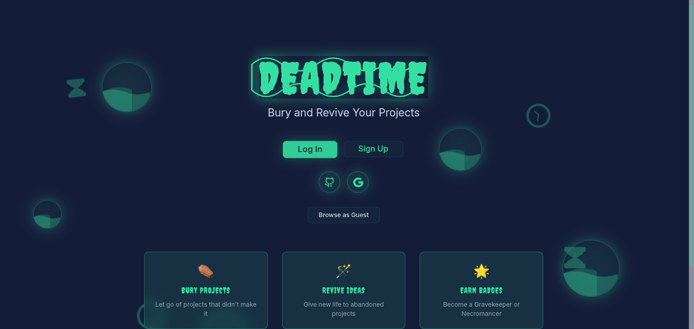
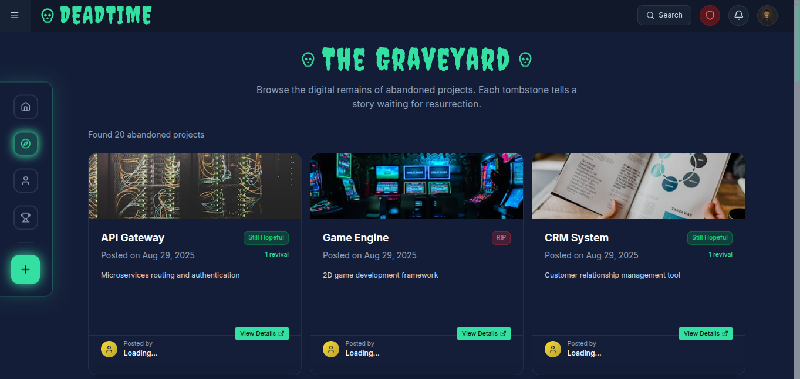
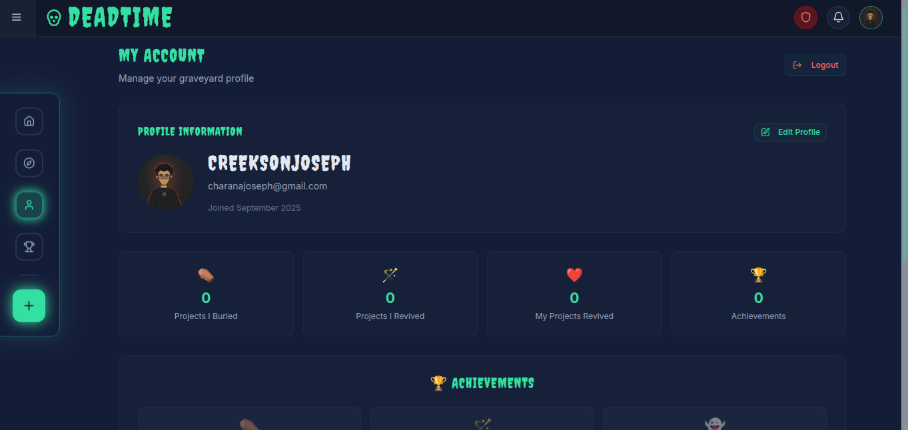
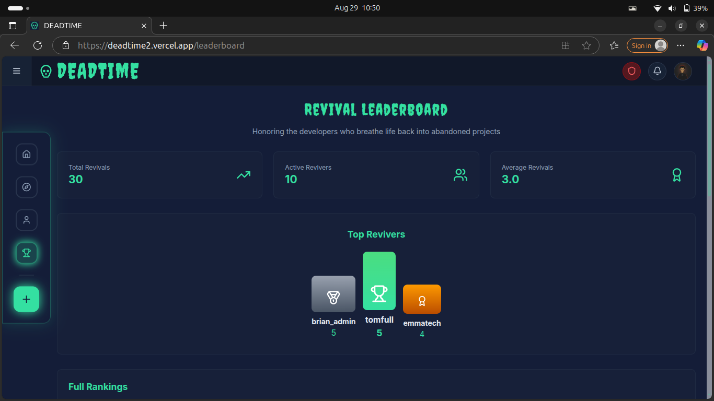
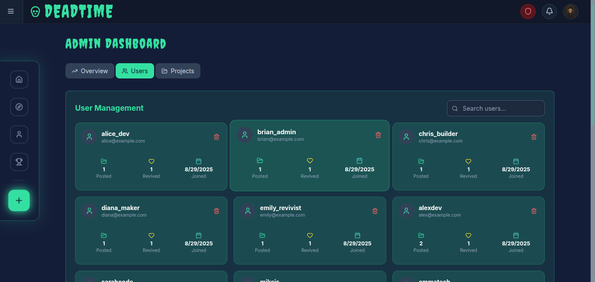
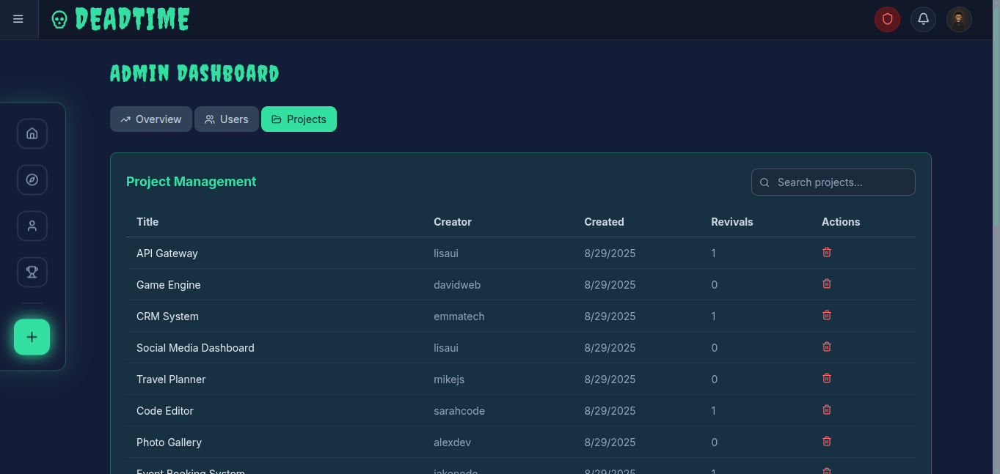

# Deadtime 💀

> _A full-stack MERN application where users can bury abandoned projects and revive forgotten ideas - turning digital graveyards into innovation hubs._

[](https://deadtime2.vercel.app)
[](https://deadtime.onrender.com)

---

## 📖 Table of Contents

1. [🌍 About the Project](#-about-the-project)
2. [✨ Features](#-features)
3. [🧰 Tech Stack](#-tech-stack)
4. [📸 UI Previews](#-ui-previews)
5. [🚀 Getting Started](#-getting-started)
6. [🔐 Authentication Flow](#-authentication-flow)
7. [📝 API Overview](#-api-overview)
8. [🔮 Future Improvements](#-future-improvements)
9. [📩 Contact](#-contact)

---

## 🌍 About the Project

**Deadtime** is a digital graveyard where developers can:

- **Bury** their abandoned projects with dignity
- **Revive** forgotten ideas and give them new life
- **Discover** hidden gems from other developers
- **Build** a community around project resurrection

Think of it as GitHub meets archaeology - where every abandoned repository has a chance at redemption.

### 🎯 Problem Statement

Developers often abandon projects due to time constraints, changing priorities, or technical roadblocks. These projects contain valuable ideas and code that could benefit others, but they remain buried in private repositories or forgotten folders.

### 💡 Solution

Deadtime provides a platform where developers can:

- Share their abandoned projects openly
- Allow others to adopt and continue development
- Create a collaborative ecosystem of project revival
- Track contributions and build reputation through revivals

---

## ✨ Features

### 🏗️ Core Functionality

- **🪦 Ghostcards** - Abandoned project listings with detailed information
- **💬 Ghostnotes** - Community comments and discussions on projects
- **⚡ Revive** - Adopt and continue development of abandoned projects
- **🕳️ Bury** - Submit your abandoned projects to the graveyard
- **🏛️ Graveyard** - Browse all available abandoned projects

### 👥 User Management

- **🧑 Regular Users** - Can bury projects, revive others' work, and participate in discussions
- **🛡️ Admin Users** - Enhanced privileges for content moderation and user management
- **📊 User Analytics** - Track burial/revival statistics and community contributions

### 🔐 Authentication & Security

- **JWT-based Authentication** - Secure token-based user sessions
- **OAuth Integration** - GitHub authentication for seamless developer onboarding
- **Role-based Access Control** - Different permissions for users and admins
- **Session Persistence** - Automatic login state management

### 📈 Community Features

- **🏆 Leaderboard** - Merit-based ranking system for most active revivers
- **📊 Dashboard** - Personal statistics and project management
- **👤 User Profiles** - Detailed account pages with project history and achievements
- **🎖️ Achievement System** - Badges and recognition for community contributions

### 🎨 User Experience

- **📱 Responsive Design** - Optimized for desktop, tablet, and mobile devices
- **🌙 Dark Theme** - Graveyard-inspired dark UI with neon accents
- **⚡ Fast Loading** - Optimized performance with caching strategies
- **🔍 Search & Filter** - Easy project discovery with advanced filtering
- **📤 Guest Browsing** - Explore projects without creating an account

---

## 🧰 Tech Stack

### Frontend

- **⚛️ React 19** - Modern UI library with latest features
- **🎨 Tailwind CSS** - Utility-first CSS framework
- **🎭 Framer Motion** - Smooth animations and transitions
- **🧭 React Router** - Client-side routing
- **📡 Axios** - HTTP client for API communication
- **🎯 Lucide React** - Beautiful icon library

### Backend

- **🟢 Node.js** - JavaScript runtime environment
- **🚀 Express.js** - Web application framework
- **🍃 MongoDB** - NoSQL database with Mongoose ODM
- **🔐 JWT** - JSON Web Token authentication
- **🔒 bcrypt** - Password hashing
- **🐙 GitHub OAuth** - Third-party authentication

### DevOps & Deployment

- **▲ Vercel** - Frontend hosting and deployment
- **🚂 Render** - Backend API hosting
- **☁️ Cloudinary** - Image storage and optimization
- **🔧 Vite** - Fast build tool and development server

### Development Tools

- **📝 ESLint** - Code linting and formatting
- **🎨 Prettier** - Code formatting
- **📦 npm** - Package management
- **🔄 Git** - Version control

---

## 📸 UI Previews

### 🏠 Landing Page



- Animated graveyard theme with floating elements
- Clear call-to-action buttons
- Feature highlights with visual icons

### 🏛️ Project Browser



- Grid layout with project cards
- Advanced search and filtering
- Detailed project information modals

### 👤 User Profiles



- Comprehensive user statistics
- Project history and contributions
- Achievement badges and rankings

### 🏆 Leaderboard



- Merit-based ranking system
- Top revivers showcase
- Community engagement metrics

### 🛡️ Admin Dashboard

#### Overview


#### User Management



#### Project Management



- Comprehensive admin controls
- User and project management
- System analytics and monitoring

---

## 🚀 Getting Started

### Prerequisites

- **Node.js** (v18 or higher)
- **npm** or **yarn**
- **MongoDB** database
- **Cloudinary** account (for image uploads)
- **GitHub OAuth App** (for authentication)

### 🔧 Installation

1. **Clone the repository**

   ```bash
   git clone https://github.com/yourusername/deadtime.git
   cd deadtime
   ```

2. **Install dependencies**

   ```bash
   # Install server dependencies
   cd server
   npm install

   # Install client dependencies
   cd ../client-side
   npm install
   ```

3. **Environment Setup**

   **Server (.env)**

   ```env
   MONGO_URI=your_mongodb_connection_string
   JWT_SECRET=your_jwt_secret_key
   GITHUB_CLIENT_ID=your_github_oauth_client_id
   GITHUB_CLIENT_SECRET=your_github_oauth_client_secret
   ADMIN_EMAILS=admin1@email.com,admin2@email.com
   PORT=5000
   ```

   **Client (.env)**

   ```env
   VITE_CLOUDINARY_NAME=your_cloudinary_cloud_name
   VITE_CLOUDINARY_PRESET=your_upload_preset
   ```

4. **GitHub OAuth Setup**
   - Go to GitHub Settings > Developer settings > OAuth Apps
   - Create new OAuth App with:
     - **Homepage URL**: `https://yourdomain.com`
     - **Authorization callback URL**: `https://your-server-domain.com/api/auth/github/callback`

5. **Start Development Servers**

   ```bash
   # Start backend server (from server directory)
   npm start

   # Start frontend development server (from client-side directory)
   npm run dev
   ```

6. **Access the Application**
   - Frontend: `http://localhost:5173`
   - Backend API: `http://localhost:5000`

## 🔐 Authentication Flow

### 📧 Email/Password Authentication

1. User submits credentials
2. Server validates and hashes password
3. JWT token generated and returned
4. Client stores token in localStorage
5. Token included in subsequent API requests

### 🐙 GitHub OAuth Flow

1. User clicks "Login with GitHub"
2. Redirected to GitHub authorization
3. User grants permissions
4. GitHub redirects to server callback
5. Server exchanges code for access token
6. User profile fetched from GitHub API
7. User created/updated in database
8. JWT token generated and returned
9. Client receives token and user data

### 🔒 Protected Routes

- Dashboard, Account, Admin pages require authentication
- JWT middleware validates tokens on server
- Client-side route protection with React context

---

## 📝 API Overview

### 🔐 Authentication Endpoints

```
POST /api/auth/signup          # User registration
POST /api/auth/login           # User login
GET  /api/auth/github          # GitHub OAuth redirect
GET  /api/auth/github/callback # GitHub OAuth callback
```

### 👤 User Management

```
GET    /api/users              # Get all users (admin)
GET    /api/users/:id          # Get user profile
PUT    /api/users/:id          # Update user profile
DELETE /api/users/:id          # Delete user (admin)
```

### 🪦 Project Management

```
GET    /api/ghostcards         # Get all projects
POST   /api/ghostcards         # Create new project
GET    /api/ghostcards/:id     # Get project details
PUT    /api/ghostcards/:id     # Update project
DELETE /api/ghostcards/:id     # Delete project
```

### 💬 Comments System

```
GET    /api/ghostnotes/:projectId  # Get project comments
POST   /api/ghostnotes             # Add comment
PUT    /api/ghostnotes/:id         # Update comment
DELETE /api/ghostnotes/:id         # Delete comment
```

### ⚡ Revival System

```
POST   /api/revive/:projectId      # Revive a project
GET    /api/revive/user/:userId    # Get user's revivals
```

### 🏆 Leaderboard

```
GET    /api/leaderboard            # Get top users by revivals
```

---

## 🔮 Future Improvements

### 🚀 Planned Features

- **🔔 Real-time Notifications** - WebSocket integration for live updates
- **🤝 Collaboration Tools** - Team-based project revival
- **📊 Advanced Analytics** - Detailed project and user insights
- **🏷️ Tagging System** - Better project categorization
- **⭐ Rating System** - Community-driven project quality ratings
- **📱 Mobile App** - Native iOS/Android applications
- **🔗 Git Integration** - Direct repository linking and management
- **💰 Monetization** - Premium features for power users

### 🛠️ Technical Enhancements

- **🔄 Real-time Updates** - Live project status changes
- **📈 Performance Optimization** - Database indexing and caching
- **🔍 Advanced Search** - Elasticsearch integration
- **🌐 Internationalization** - Multi-language support
- **♿ Accessibility** - WCAG compliance improvements
- **🧪 Testing Suite** - Comprehensive unit and integration tests

---

## 📩 Contact

### 👥 Development Team

- **Backend Developer**: [deogracious Siatah](mailto:deosiatah0@gmail.com)
- **UI/UX Designer and frontend developer**: [Joseph Charana](mailto:charanajoseph@gmail.com)

### 🔗 Links

- **🌐 Live Application**: [https://deadtime2.vercel.app](https://deadtime2.vercel.app)
- **📡 API Server**: [https://deadtime.onrender.com](https://deadtime.onrender.com)
- **📂 GitHub Repository**: [https://github.com/creeksonJoseph/Deadtime/](https://github.com/creeksonJoseph/Deadtime/)

### 🤝 Contributing

We welcome contributions! Please read our [Contributing Guidelines](CONTRIBUTING.md) and [Code of Conduct](CODE_OF_CONDUCT.md).

### 📄 License

This project is licensed under the MIT License - see the [LICENSE](LICENSE) file for details.

---

**Built with ❤️ by the Deadtime Team**

_Giving abandoned projects a second chance at life_ 💀➡️✨
